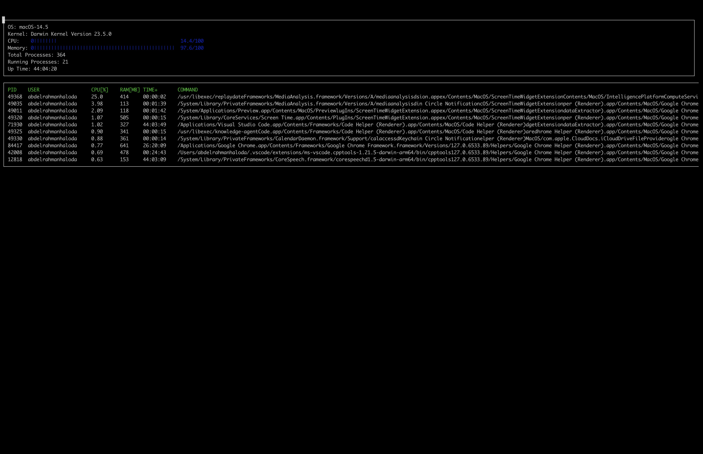
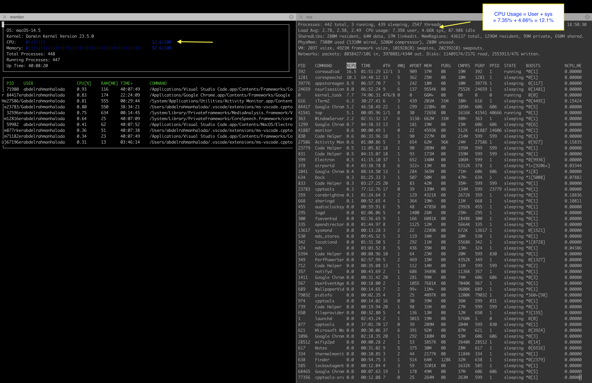

# CppND-System-Monitor

This is the code for my System Monitor Project in the Object Oriented Programming Course of the [Udacity C++ Nanodegree Program](https://www.udacity.com/course/c-plus-plus-nanodegree--nd213). 

---

## Overview
The **system monitor** program 
**- lists and monitor the system information:**
  * [the operating system, kernel version, memory utilization, total number of processes, number of running processes, and uptime.]

**- Lists and monitor system processes:**
  * [Processes Ids, and theri assocciated User, Cpu usage, Ram consumption, uptime and command]

**NOTE:**
The Project is structured to support different Operating-Systems however, it currently supports Mac - Operating System.
Linux shall be supoorted soon.

---

## Dependencies

#### 1- <u>ncurses library</u>
[ncurses](https://www.gnu.org/software/ncurses/) is a library that facilitates text-based graphical output in the terminal. This project relies on ncurses for display output.

**For linux Environment**
You need to install ncurses within your own Linux environment:     
**`sudo apt install libncurses5-dev libncursesw5-dev`**

**For MacOS**
macOS includes the ncurses library by default, so you generally don't need to install it separately, however if you need to install or update ncurses, you can use Homebrew.
**Installing with Homebrew**
**`brew install ncurses`**

#### 2- <u>Make</u>
This project uses [Make](https://www.gnu.org/software/make/). The Makefile has four targets:

1- Compiles the source code and generates an executable
**For Linux platform** 
**`make build pf=linux`**

**MacOs platform**
**`make build pf=macos`**

2 - Applies [ClangFormat](https://clang.llvm.org/docs/ClangFormat.html) to style the source code
**`make format`**

3 - Compiles the source code and generates an executable, including debugging symbols
**For Linux platform**
**`make debug pf=linux`**

**MacOs platform**
**`make debug pf=macos`**

4- Deletes the `build/` directory, including all of the build artifacts
**`make clean`**

---

## Instructions

1. Clone the project repository: 
**` git clone https://github.com/AbdelrahmanHaloda/SystemMonitor.git`**

2. Build the project: 
**`make build pf=linux`**
**`make build pf=macos`**

3. Run the resulting executable: 
**`./build/monitor`**

---

## TBD

   - Refactor ncurses_display to be a class.
   - Fix Wanings in ncurses_display.
   - Support Linux Os.

---